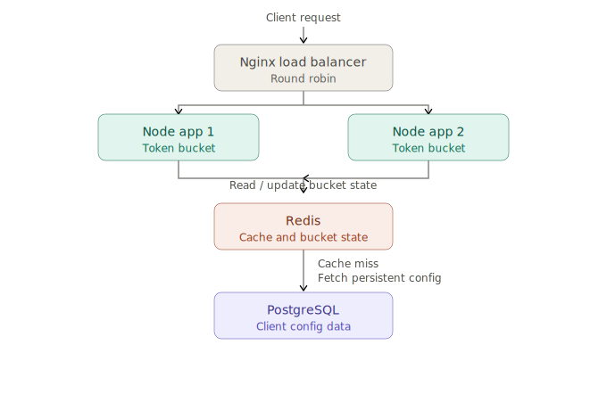

<p align="center">
  
</p>

<h1 align="center"> Rate Limiter Service</h1>

<p align="center">
A production-ready distributed <b>Rate Limiter Service</b> built using <b>Node.js</b>, <b>Express.js</b>, <b>Redis</b>, <b>PostgreSQL</b>, <b>Prisma ORM</b>, <b>Docker</b>, and <b>Nginx</b>.
</p>

<p align="center">


</p>


---

## 📖 Overview

Rate Limiter Service is a production-ready backend application that implements the **Token Bucket Algorithm** to efficiently control API traffic. The project is horizontally scalable using multiple Node.js instances behind an Nginx Load Balancer while maintaining a shared bucket state through Redis and persistent configuration in PostgreSQL.


## ✨ Features

### 🚀 Core Functionality

* Implements the **Token Bucket Algorithm** for efficient API rate limiting.
* Supports configurable **capacity** and **refill rate** for each client.
* Provides **Admin APIs** to create, update, retrieve, and delete client configurations.
* Maintains persistent client configurations in **PostgreSQL**.

---

### ⚡ High Performance

* Stores bucket state in **Redis** for fast read/write operations.
* Caches client configurations in Redis to minimize unnecessary database queries.
* Automatically refills tokens based on the configured refill rate.
* Designed to handle high request throughput with low latency.

---

### 📈 Scalability

* Supports **horizontal scaling** with multiple Node.js application instances.
* Uses **Nginx Round Robin Load Balancer** to distribute incoming traffic.
* Ensures consistent rate limiting across all application instances using shared Redis and PostgreSQL.

---

### 🐳 Containerization

* Fully containerized using **Docker**.
* Multi-container orchestration with **Docker Compose**.
* Automatically applies pending Prisma migrations during container startup.

---

### 🛡 Reliability

* Input validation using **Zod**.
* Structured request logging with **Pino**.
* Unique request IDs for easier debugging and tracing.
* Graceful shutdown to safely close database and Redis connections.

---

### 📖 Developer Experience

* Interactive API documentation using **Swagger UI**.
* Environment-based configuration using **.env**.
* Clean layered architecture (Controllers → Services → Repositories).
* Performance tested using **Autocannon**.


## 🏗️ Architecture

<p align="center">
  
</p>

The application follows a **distributed architecture** to provide high performance, scalability, and consistency.

### Request Flow

1. A client sends a request to the **Nginx Load Balancer**.
2. Nginx distributes incoming traffic across multiple **Node.js application instances** using the **Round Robin** strategy.
3. Each application instance retrieves the client configuration from **Redis Cache**. If the configuration is unavailable, it is fetched from **PostgreSQL** and cached for future requests.
4. The current bucket state is stored and updated in **Redis**, enabling all application instances to share the same rate-limiting state.
5. The **Token Bucket Algorithm** determines whether the request should be allowed or rejected based on the available tokens.
6. The updated bucket state is written back to Redis, and the API responds with the remaining token count.

### Why This Architecture?

* ⚡ **Fast** – Redis provides low-latency access for bucket state and cached client configurations.
* 📈 **Scalable** – Multiple application instances can be added behind Nginx without changing the application logic.
* 🔄 **Consistent** – Shared Redis ensures all instances enforce the same rate limits.
* 🗄️ **Reliable** – PostgreSQL acts as the persistent source of truth for client configurations.
* 🐳 **Portable** – Docker Compose enables the complete stack to run consistently across development and deployment environments.

## 🛠 Tech Stack

<p align="center">
  
</p>

<p align="center">
  <b>Node.js</b> •
  <b>Express.js</b> •
  <b>PostgreSQL</b> •
  <b>Redis</b> •
  <b>Prisma ORM</b> •
  <b>Docker</b> •
  <b>Nginx</b> •
  <b>Git</b> •
  <b>GitHub</b> •
  <b>Postman</b> •
  <b>VS Code</b> •
  <b>Swagger UI</b> •
  <b>Zod</b> •
  <b>Pino</b> •
  <b>Autocannon</b>
</p>

## 📁 Project Structure

```text
Rate-Limiter-Service
│
├── 📂 assets          # README images
├── 📂 nginx           # Nginx Load Balancer configuration
├── 📂 prisma          # Prisma schema & migrations
├── 📂 src
│   ├── config         # Database, Redis & Logger configuration
│   ├── controllers    # Request handlers
│   ├── middlewares    # Validation & logging middlewares
│   ├── repositories   # Database access layer
│   ├── routes         # API routes
│   ├── services       # Business logic
│   ├── utils          # Utility functions
│   ├── validations    # Zod validation schemas
│   ├── app.js
│   └── server.js
│
├── .dockerignore
├── .env.example
├── .gitignore
├── Dockerfile
├── docker-compose.yml
├── package.json
└── README.md
```

## 🚀 Getting Started

### Prerequisites

Before running the project, ensure you have the following installed:

* Node.js (v22 or later)
* PostgreSQL
* Redis
* Docker & Docker Compose (optional, recommended)

---

### Clone the Repository

```bash
git clone https://github.com/<your-username>/Rate-Limiter-Service.git
cd Rate-Limiter-Service
```

---

### Install Dependencies

```bash
npm install
```

---

### Environment Variables

Create a `.env` file in the project root using `.env.example`.


### Run the Application

Development

```bash
npm run dev / nodemon
```

Production

```bash
npm start
```

